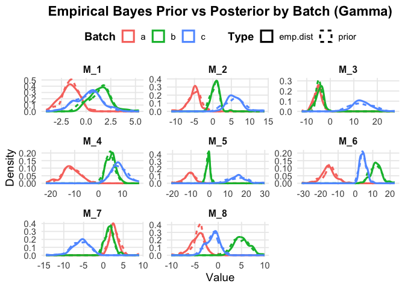
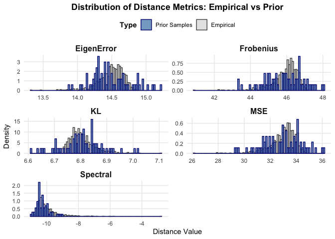
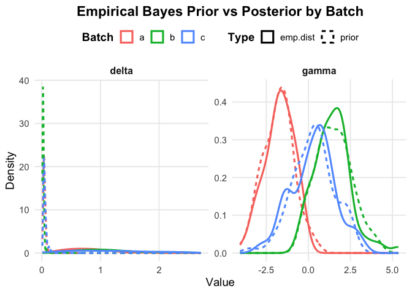
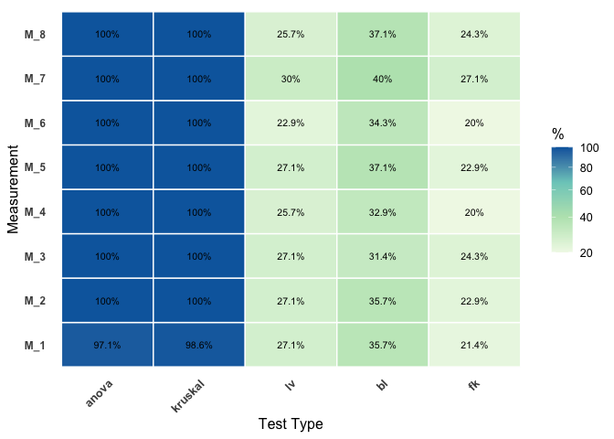
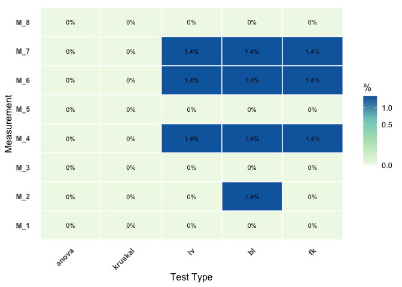
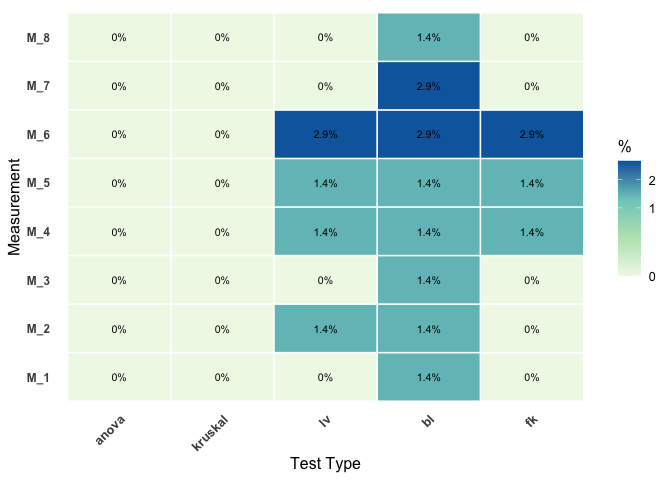

<!-- README.md is generated from README.Rmd. Please edit that file -->

# MultiComBat

<!-- badges: start -->

[](https://github.com/Zheng206/MultiComBat/actions/workflows/R-CMD-check.yaml)
[](https://app.codecov.io/gh/Zheng206/MultiComBat)
<!-- badges: end -->

We provide tools for ComBat-style batch harmonization in both univariate
(in one measurement) and multivariate (across modalities/measurements)
settings with:

- fast **Empirical Bayes (EB)** shrinkage,
- optional **robust** scale/covariance estimators,
- a **full Bayesian** MCMC variant via **Stan**,
- and a suite of **diagnostics** & plots to evaluate remaining batch
  effects.

## Motivation

To help jointly harmonize biologically coupled features, we propose a
multivariate framework extending existing ComBat methods, which were
developed primarily for the single-measurement setting. Harmonizing
multiple, closely related measurements independently can ignore genuine
biological correlation across measurements. That omission can:

- under- or over-correct batch effects,
- distort cross-measurement covariance structures that carry biology,
- and reduce downstream statistical power.

**MultiComBat** addresses these challenges by modeling batch effects
across measurements, *improving harmonization* while better *preserving
biological cross-measurement dependence*.

## Installation

You can install the development version of MultiComBat from
[GitHub](https://github.com/) with:

``` r
library(devtools)
devtools::install_github("Zheng206/MultiComBat")
```

## Quick Start

We use an example from the simulation to demonstrate the basic features
of MultiComBat.

``` r
library(MultiComBat)
sim_result <- simulate_data.m(K = 3, p = 70, n = 100, bt_type = "AR", w_type = "compound_symmetry", w_params = list(rho = 0.7, scale = 1), by_params = list(rho = 0.8, scale = 1), add_covariates = TRUE, add_biomarkers = TRUE, m = 8, add_outlier = FALSE, add_noise = FALSE, global_batch_strength = 30, batch_cov = 10, sd_b = 0.1, sigma = 1, outlier_size = 5, seed = 123, prior_type = "LKJ")
```

### Harmonization

- Multivariate ComBat

``` r
harm_result_mul <- com_harm.multivariate(sim_result$batch, sim_result$data, covar = sim_result$covariates, model = lm, formula = y ~ Age + Sex + Diagnosis, eb = TRUE)$harm_data
```

``` r
eb_result_mul <- com_harm.multivariate(sim_result$batch, sim_result$data, covar = sim_result$covariates, model = lm, formula = y ~ Age + Sex + Diagnosis, eb = TRUE)$eb_result
eb_df_mul <- eb_check(eb_result_mul)
eb_plot(eb_df_mul)
eb_plot(eb_df_mul, param = "delta", bat = "a")
```



- Univariate ComBat

``` r
m <- length(sim_result$data)
harm_result_uni <- lapply(1:m, function(i) com_harm(sim_result$batch[[i]], sim_result$data[[i]], covar = sim_result$covariates[[i]], model = lm, formula = y ~ Age + Sex + Diagnosis, eb = TRUE)$harm_data)
```

``` r
eb_result_uni <- com_harm(sim_result$batch[[1]], sim_result$data[[1]], covar = sim_result$covariates[[1]], model = lm, formula = y ~ Age + Sex + Diagnosis, eb = TRUE)$eb_result
eb_df_uni <- eb_check(eb_result_uni)
eb_plot(eb_df_uni)
eb_plot(eb_df_uni, param = "delta")
```



### Batch Effect Diagnostics

- Univariate Test

``` r
uni_result_unharm <- uni_test(sim_result$batch, sim_result$data, sim_result$covariates, model = lm, formula = y ~ Age + Sex + Diagnosis)
uni_result_mul <- uni_test(sim_result$batch, harm_result_mul, sim_result$covariates, model = lm, formula = y ~ Age + Sex + Diagnosis)
uni_result_uni <- uni_test(sim_result$batch, harm_result_uni, sim_result$covariates, model = lm, formula = y ~ Age + Sex + Diagnosis)
uni_plot(uni_result_unharm)
uni_plot(uni_result_mul)
uni_plot(uni_result_uni)
```



- Multivariate Test

``` r
mul_result_unharm <- mul_test(sim_result$batch, sim_result$data, sim_result$covariates, model = lm, formula = y ~ Age + Sex + Diagnosis)
mul_result_mul <- mul_test(sim_result$batch, harm_result_mul, sim_result$covariates, model = lm, formula = y ~ Age + Sex + Diagnosis)
mul_result_uni <- mul_test(sim_result$batch, harm_result_uni, sim_result$covariates, model = lm, formula = y ~ Age + Sex + Diagnosis)
mul_result_unharm
#>   manova_result boxM_result
#> 1       100.00%      74.29%
mul_result_mul 
#>   manova_result boxM_result
#> 1         0.00%       0.00%
mul_result_uni
#>   manova_result boxM_result
#> 1         0.00%      51.43%
```
