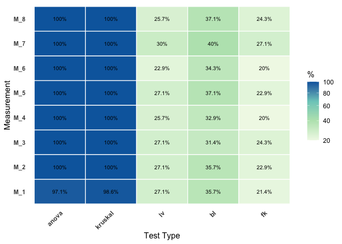

<!-- README.md is generated from README.Rmd. Please edit that file -->

# MultiComBat

<!-- badges: start -->

[](https://github.com/Zheng206/MultiComBat/actions/workflows/R-CMD-check.yaml)
[](https://github.com/Zheng206/MultiComBat/actions/workflows/test-coverage.yaml)
<!-- badges: end -->

The goal of MultiComBat is to …

## Installation

You can install the development version of MultiComBat from
[GitHub](https://github.com/) with:

``` r
library(devtools)
devtools::install_github("Zheng206/MultiComBat")
```

## Example

This is an example from the simulation that demonstrates the basic
features of MultiComBat.

``` r
library(MultiComBat)
sim_result <- simulate_data.m(K = 3, p = 70, n = 100, bt_type = "AR", w_type = "compound_symmetry", w_params = list(rho = 0.7, scale = 1), by_params = list(rho = 0.8, scale = 1), add_covariates = TRUE, add_biomarkers = TRUE, m = 8, add_outlier = FALSE, add_noise = FALSE, global_batch_strength = 30, batch_cov = 10, sd_b = 0.1, sigma = 1, outlier_size = 5, seed = 123, prior_type = "LKJ")
```

### Batch Effect Diagnostics

- Univariate Test

``` r
uni_result <- uni_test(sim_result$batch, sim_result$data, sim_result$covariates, model = lm, formula = y ~ Age + Sex + Diagnosis)
uni_plot(uni_result)
```



- Multivariate Test

``` r
mul_result <- mul_test(sim_result$batch, sim_result$data, sim_result$covariates, model = lm, formula = y ~ Age + Sex + Diagnosis)
mul_result
#>   manova_result boxM_result
#> 1       100.00%      74.29%
```
